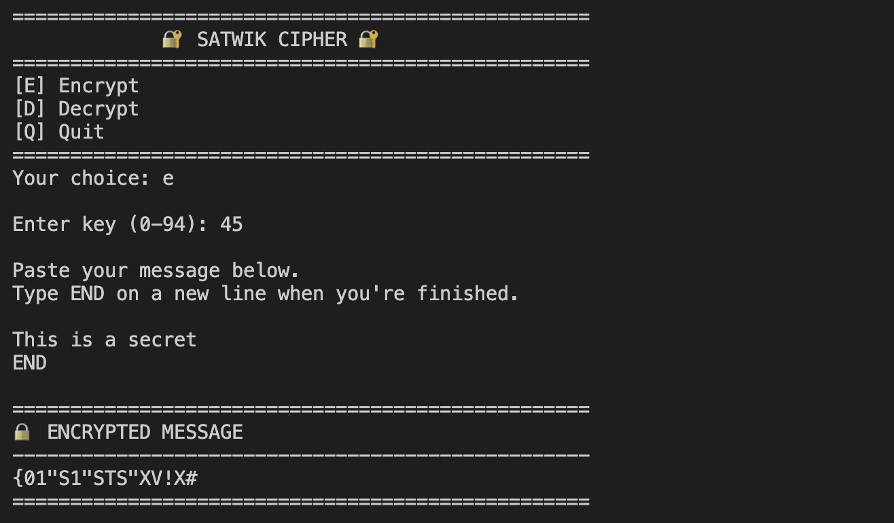
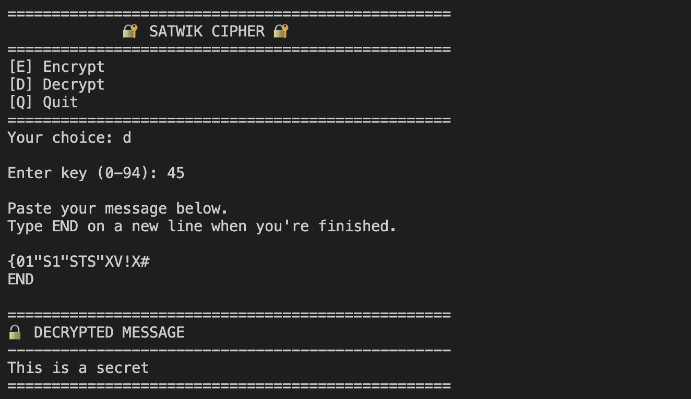

# Satwik Cipher

A Python command-line program that encrypts and decrypts text using a rotation (shift) cipher which is an extended version of caesar cipher.

## Features

- Encrypt and decrypt messages
- Supports letters, numbers, symbols, and spaces
- User-defined shift key
- Interactive command-line interface

## Encryption


#### Now Decryption of the cipher text:


## Run

```bash
python rot_cipher.py
```

## Purpose

Built to practice Python programming, string manipulation, and basic cryptography concepts.
